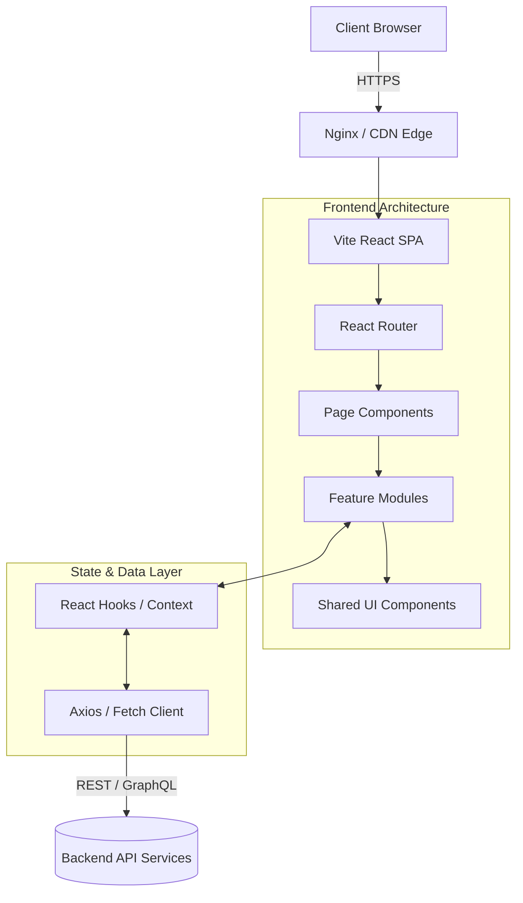
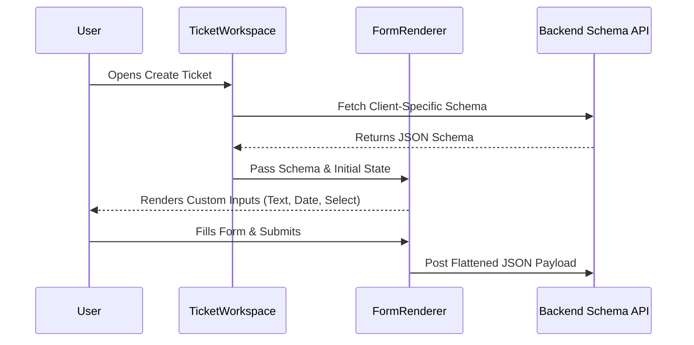
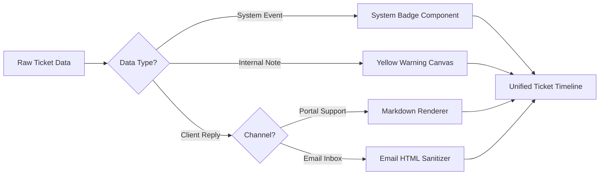
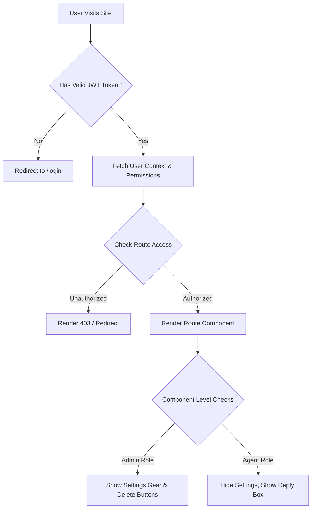
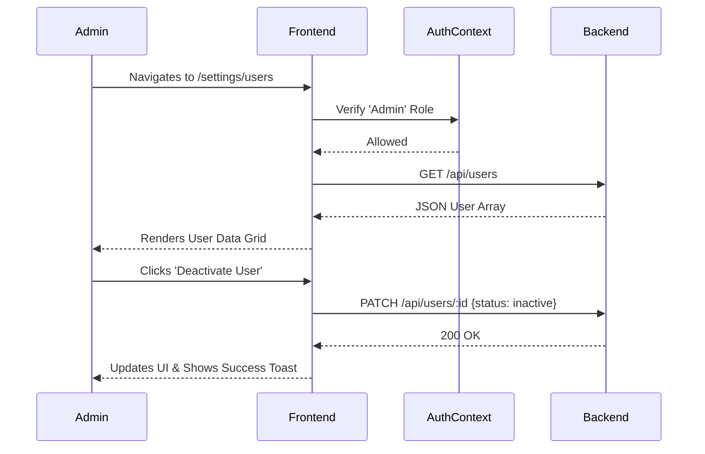

# 🏗 System Architecture

Flow Enterprise Support is engineered for high performance, maintainability, and massive scalability. This document outlines the structural foundation of the platform.

---

## 1. High-Level Architecture

The platform operates as a decoupled Single Page Application (SPA). The frontend is strictly responsible for presentation, state management, and schema rendering, while relying on asynchronous API layers for persistence.



---

## 2. Dynamic Form Engine

To support multi-tenancy without altering the database schema or frontend code per client, Flow uses a Dynamic Form Engine.



---

## 3. Conversation Rendering Pipeline

Tickets contain interleaved events (public replies, internal notes, system changes). The rendering pipeline intelligently parses and formats these streams.



---

## 4. Authentication & RBAC Flow

Security is handled via JWT and mirrored in the frontend to proactively hide unauthorized UI elements.



---

## 5. Folder Structure & Component Hierarchy

Components follow a modified Atomic Design methodology.

```text
src/
├── components/
│   ├── ui/               # Atoms & Molecules (Buttons, Inputs, Badges)
│   ├── layout/           # Global shells (Sidebar, Header, Layout Wrappers)
│   └── shared/           # Cross-domain widgets (FilterDrawers, Pagination)
├── pages/                # Smart components representing full routing views
├── types/                # Global TypeScript definitions
└── utils/                # Pure functions, formatters, and helpers
```

## 6. State Management Strategy

- **Local State (`useState`):** Used for isolated UI interactions (dropdown toggles, hover states, immediate form inputs).
- **Complex Component State (`useReducer`):** Used for multi-step forms and complex ticket filtering criteria.
- **Global State:** Planned implementation via Context API / Zustand for global authentication state, theme preferences, and cross-tab synchronization.

---

## 7. Internal User Management Flow

The internal directory operates strictly under role-based logic.


