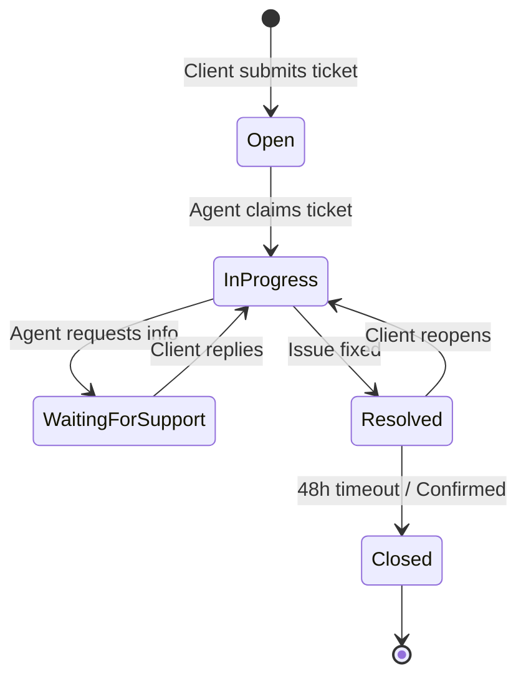

# Product Requirements Document (PRD)

## 1. Executive Summary
Flow Enterprise Support is a B2B SaaS platform designed to streamline IT support, client service, and internal task management. It replaces fragmented legacy systems with a unified, consumer-grade workspace.

## 2. Goals & Objectives
- **Operational Efficiency:** Reduce MTTR by 20% through a unified agent workspace.
- **Visibility:** Provide managers with real-time SLA metrics.
- **Scalability:** Support multi-tenant environments with dynamic field configurations.

---

## 3. Core Logic: Ticket Lifecycle

The heart of the application revolves around the strict progression of a support ticket.

---

## 4. User Roles
- **System Admin:** Complete control over tenants, configurations, and global users.
- **Manager:** Can view reports, manage team queues, and reassign tickets.
- **Agent:** Handles day-to-day ticket resolution and task execution.
- **Client (Requestor):** Can submit tickets, view their own ticket history, and communicate with agents.

## 5. Functional Requirements

### 5.1 Authentication & Authorization
- JWT-based authentication.
- Strict RBAC enforced at the route and component level.

### 5.2 Ticket Management
- Create, view, update, and close tickets.
- Assign tickets to queues or individual agents.
- Priority levels: Low, Medium, High, Critical.
- Chronological timeline capturing system events, internal notes, and public replies.

### 5.3 Task Management
- Standalone tasks or tasks linked to specific tickets.
- Status tracking (To Do, In Progress, Review, Done).

### 5.4 Reporting & Dashboard
- Visual aggregation of ticket statuses.
- Global date range filtering.

## 6. Non-Functional Requirements
- **Performance:** App shell must load in < 2 seconds.
- **Accessibility:** WCAG 2.1 AA compliance (contrast ratios, keyboard navigation).
- **Responsiveness:** Fully functional on mobile, tablet, and desktop.

## 7. Success Metrics
- Daily Active Users (DAU) adoption rate.
- Average Handle Time (AHT).
- Customer Satisfaction Score (CSAT).
